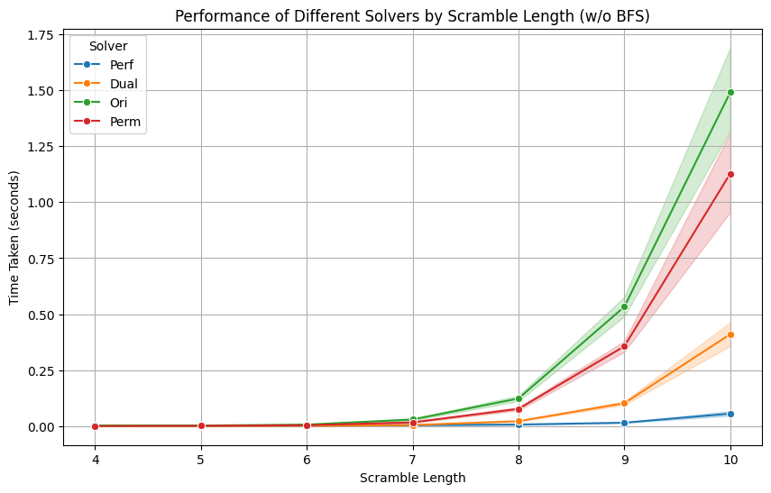

# Computational Intelligence for Games Final Project

## Project Description

Our project analyzes a particular optimal solver for the 2x2x2 Rubik's Cube. We wanted to create a performant solver that yields optimal solutions. We tailored an admissible A* heuristic for this purpose. Let $C$ be a the state of a 2x2x2 Rubik's Cube, let $M$ be the set of all possible moves so that $M^\Sigma$ is the set of all sequences of moves. For some element $S \in M^\Sigma$ let $S(C)$ be the state of the cube after applying the sequence of moves $S$ to the cube $C$. We define the heuristic $h$ as follows:

$$h(C) = \max \{ \min_{S \in M^\Sigma} \{ |S| : S(C) \text{ is oriented}\}, \min_{S \in M^\Sigma} \{|S| : S(C) \text{ is permuted}\}\}$$

where orientation and permutation of a cube are two properties of a cube, both of which are required to be satisfied for a cube to be in a solved state. 
This is an admissible heuristic because it is the maximum of two admissible heuristics. The first heuristic is the minimum of the lengths of sequences across orientations and the second heuristic is the minimum of the lengths of sequences across permutations. 

We had two primary questions: 

1. How fast is A* with this heuristic compared to a baseline BFS algorithm?
2. How tight is the heuristic?

## Running the Code

Our code is written in C++. We provide a CLI with the `argparse.h` library, which is modeled after the `argparse` library in Python (credit to p-ranav). The required first argument is the mode. There are three modes:

1. `solve` - This mode allows the user to specify a single scramble string and optionally a specific type of solver and the program will output an optimal solution, along with some information about how long it took. This is the primary mode for the user to interact with the program.
2. `benchmark` - The user specifies a number of trials. The program generates one file with that many random scrambles and solves them with every type of solver, and saves the results to another comma-separated file.
3. `heuristic` - No user arguments. This mode compares all heuristics and the optimal length of the solution for each scramble, evaluated at all possible positions, and saves the results to a comma-separated file.

For `solve`, the user must specify a scramble. A scramble must be supplied in standard WCA notation, enclosed in double quotes. They may specify a solver. There are five solvers:

1. `bfs` - Breadth-first search
2. `astardual` - A* with the dual heuristic (the one described above), which is at least as tight as `astarori` and `astarperm`
3. `astarori` - A* with the orientation heuristic
4. `astarperm` - A* with the permutation heuristic
5. `astarperf` - A* with a perfectly tight heuristic, a theoretical best agent

Otherwise the program will default to `astardual`. If the program is called with `astarperfect` it will load the perfect heuristic lookup table, which may take a few seconds.

A few examples of running the program with `solve`:

    ./CubeSolver --solve --scramble "F2 U R' U F U' F2 R2 F'"                    # Uses astardual
    ./CubeSolver --solve --scramble "R' U2 F' R2 F' U' R2 U2 R'" --solver bfs
    ./CubeSolver --solve --scramble "U R' F' R2 F' U F U' F" --solver astarori
    ./CubeSolver --solve --scramble "F U2 R' F U2 F U R' U'" --solver astarperf  # Uses the perfect heuristic. Will load the lookup table into memory.

The other modes are used for the analysis in the "Results" section.

## Results

### Performance

Performance was assessed by generating a 250 random scrambles of 15 moves in length. During scramble generation, sequences of moves that self-inverted were disallowed. Recall that at a maximum, a 2x2x2 Rubik's Cube is solvable in 11 moves. Scrambling in this kind of way makes it likely that the scramble falls on the upper end of the spectrum of difficulty. For all 250 scrambles, we ran all five solvers and recorded the time it took to solve each scramble with each solver. We were limited to 250 scrambles due to how long it took to run the BFS solver -- any of the A* solvers could solve all possible configurations in a shorter amount of time than it took BFS to solve 250.

Overall, the A* solvers were significantly faster than our baseline BFS, even though analysis in the next section shows that our heuristic is not very tight. Over the 250 scrambles, which had a median solution length of 8 moves, our dual heuristic finished in an average of 0.088 seconds and BFS finished in an average of 43.09 seconds. Here are some more detailed summary statistics:

    Solution Lengths:
    count    250.00000
    mean       8.18800
    std        1.31131
    min        4.00000
    25%        8.00000
    50%        8.00000
    75%        9.00000
    max       10.00000
    Name: Length, dtype: float64

    Perfect Heuristic:
    count    250.000000
    mean       0.014211
    std        0.017898
    min        0.000859
    25%        0.003898
    50%        0.009355
    75%        0.015892
    max        0.131464
    Name: Perf, dtype: float64

    Dual Heuristic
    count    250.000000
    mean       0.087805
    std        0.126078
    min        0.000228
    25%        0.013072
    50%        0.035450
    75%        0.107881
    max        0.738483
    Name: Dual, dtype: float64

    Orientation Heuristic
    count    250.000000
    mean       0.395665
    std        0.470991
    min        0.000235
    25%        0.055321
    50%        0.201744
    75%        0.594892
    max        2.632570
    Name: Ori, dtype: float64

    Permutation Heuristic
    count    250.000000
    mean       0.275673
    std        0.358965
    min        0.000202
    25%        0.039835
    50%        0.129987
    75%        0.410974
    max        2.381560
    Name: Perm, dtype: float64

    BFS
    count    250.000000
    mean      43.094818
    std       32.993968
    min        0.048749
    25%       12.488925
    50%       36.942350
    75%       69.613050
    max      113.391000
    Name: BFS, dtype: float64

Here are some line plots visualizing the performance of the various solvers. We include a line plot without BFS because of the scale of the y-axis.

Also, we tested the performance of each of the agents on a single maximally scrambled configuration (solution length of 11). A maximally scrambled configuration did not emerge in the random sample since maximally scrambled configurations are rare in space of all possible configurations. The main point of comparison is A* with the dual heuristic solved the cube in ~2.22 seconds while BFS took ~108.81 seconds. Full program output below:

    Solving with A* using dual heuristic...
    Scramble: F R U' R' U' R U R' F' R U R' U' R' F R F'
    Solution: R F' U' R' U2 R' U R F' U F2
    Solution Length: 11 moves
    Time: 2.216819 seconds

    Solving with A* using perfect heuristic...
    Scramble: F R U' R' U' R U R' F' R U R' U' R' F R F'
    Solution: R U' R' U' F2 U' R U R' U F2
    Solution Length: 11 moves
    Time: 0.365550 seconds

    Solving with A* using orientation heuristic...
    Scramble: F R U' R' U' R U R' F' R U R' U' R' F R F'
    Solution: F' U R' F' U F2 U R F U' R2
    Solution Length: 11 moves
    Time: 7.676933 seconds

    Solving with A* using permutation heuristic...
    Scramble: F R U' R' U' R U R' F' R U R' U' R' F R F'
    Solution: F2 U' F U R U2 R U' R' F R'
    Solution Length: 11 moves
    Time: 2.907306 seconds

    Solving with BFS...
    Scramble: F R U' R' U' R U R' F' R U R' U' R' F R F'
    Solution: F' U F U R2 U F' U' F U' R2
    Solution Length: 11 moves
    Time: 108.812033 seconds

### Tightness

Since the 2x2x2 state space is small (~3.67 million states), we can compute the exact length of the optimal solution for each scramble. We can then compare the heuristic value to the optimal solution length. Doing so for all three heuristics, we find that the permutation heuristic is in general better than the orientation heuristic, and the dual heuristic is better than both. 

Some summary statistics:

    Orientation Heuristic:
    count    3.674160e+06
    mean     4.319363e+00
    std      1.175741e+00
    min      0.000000e+00
    25%      4.000000e+00
    50%      4.000000e+00
    75%      5.000000e+00
    max      1.100000e+01
    Name: Orientation Difference, dtype: float64

    Permutation Heuristic:
    count    3.674160e+06
    mean     3.893672e+00
    std      1.210182e+00
    min      0.000000e+00
    25%      3.000000e+00
    50%      4.000000e+00
    75%      5.000000e+00
    max      1.100000e+01
    Name: Permutation Difference, dtype: float64

    Dual Heuristic:
    count    3.674160e+06
    mean     3.611235e+00
    std      1.045923e+00
    min      0.000000e+00
    25%      3.000000e+00
    50%      4.000000e+00
    75%      4.000000e+00
    max      8.000000e+00
    Name: Dual Difference, dtype: float64

And here are some histograms of the heuristic values compared to the optimal solution length:

## Contributors

Fyze Tulyag and Richie Hsiung, Computation Intelligence for Games, Spring 2024, taught by Professor James Glenn.